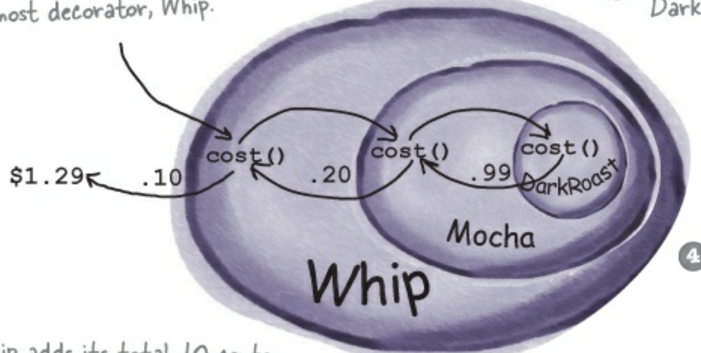

## 데코레이터 패턴
: 객체에 추가 요소를 동적으로 더함. 데코레이터를 사용하면 서브 클래스를 만들 때보다 훨씬 유연하게 기능 확장 가능

- OCP를 만족 (확장에는 열려 있고, 변경에는 닫혀 있음)
- 상속을 써야할 때 -> 특정 클래스에 공통적으로 들어가지 않거나, 클래스가 많아지는 상황 방지

** 구성 요소의 클라이언트는 데코레이터의 존재를 알 수 없음
-> 클라이언트가 구성 요소의 구체적인 형식에 의존하는 경우에는 예외 

Q. 처음에는 그런 로직이 없더라도 후에 발생하면 복잡해질 수 있는게 아닐까?
> 데코레이터 패턴을 알맞게 사용할만한 곳은 어디인가? 

** 데코레이터 패턴을 사용하면 자잘한 객체가 매우 많이 추가될 수 있고, 데코레이터를 너무 많이 사용하면 코드가 필요 이상으로 복잡해짐
-> 다중 상속의 문제점을 오히려 해결 못한 것 같다는 생각이 듬

** 자바 I/O 데코레이터 패턴

Q. 데코레이터 패턴은 상속 X 조합일까?

- 데코레이터 패턴 사용 전

1. 비슷한 것만 하위로 다시 둔다면?
2. 속성값으로 토핑들을 넣게 된다면?

- 데코레이터 패턴
